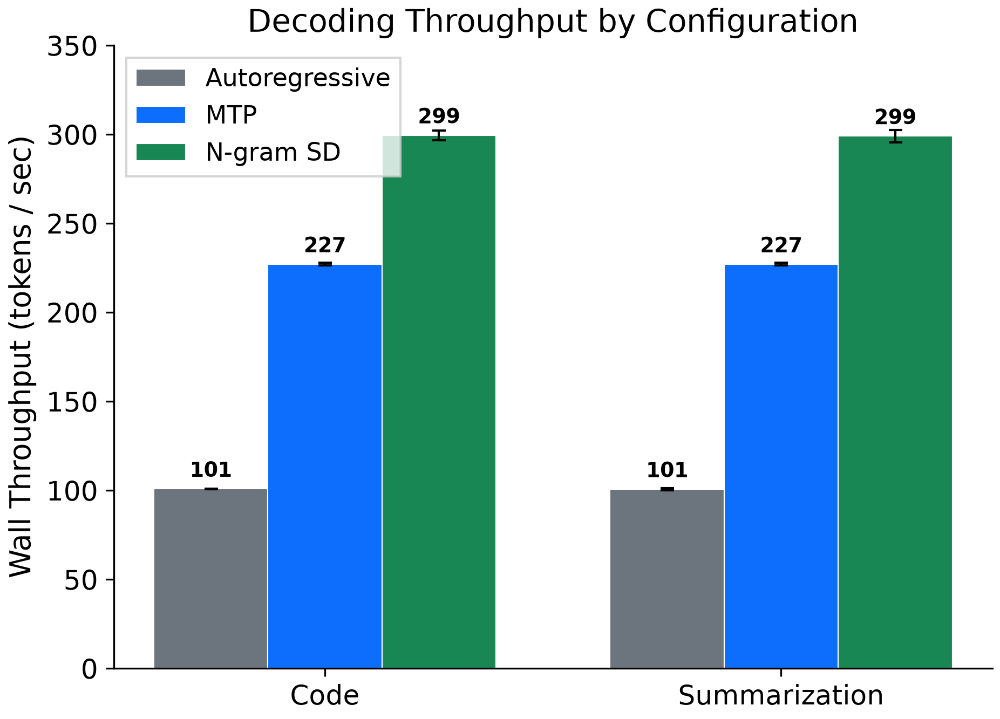
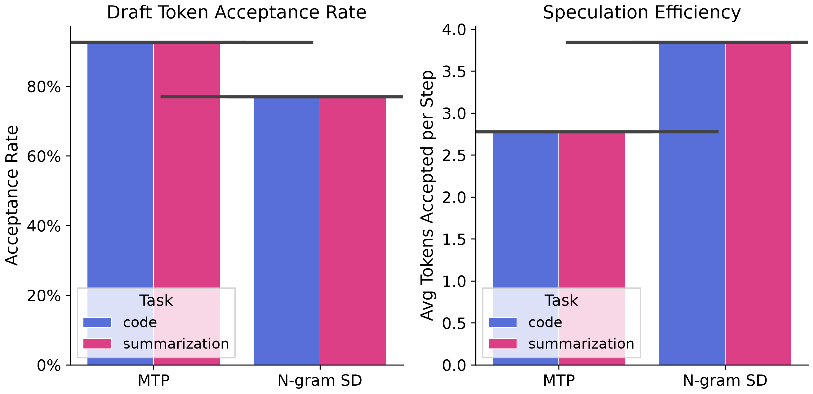
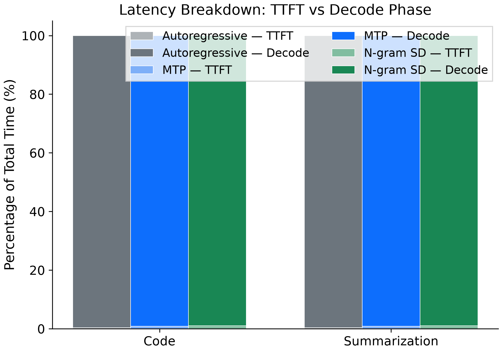
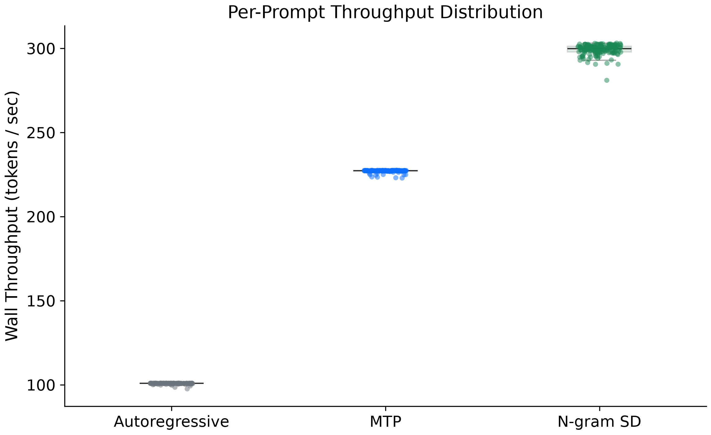
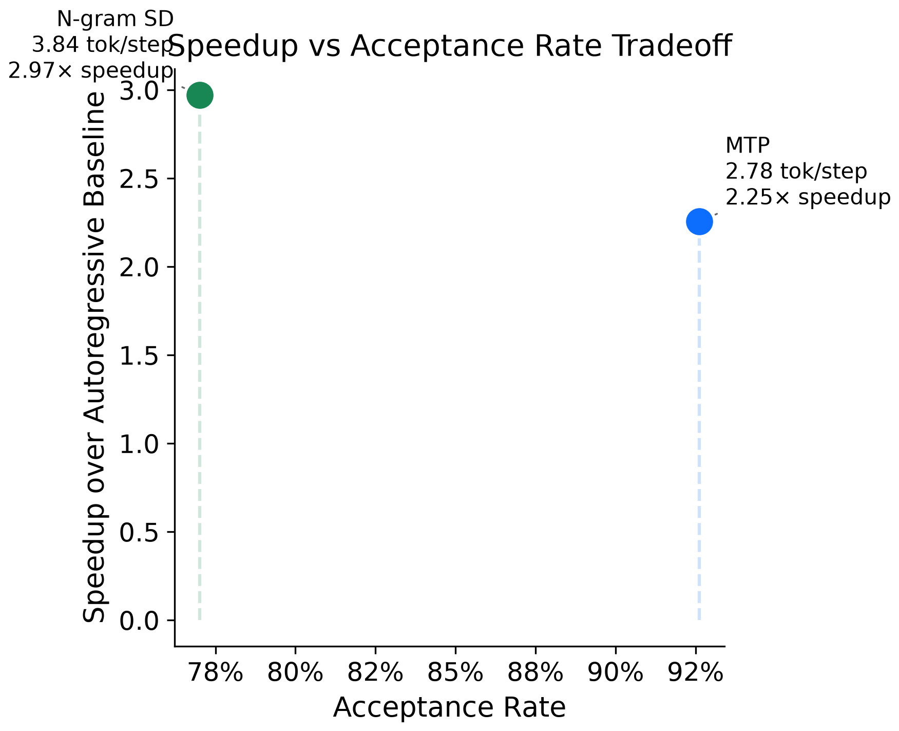

# Speculative Decoding Benchmark

Benchmark comparing three decoding strategies on **Qwen/Qwen3.5-4B** using the **nvidia/SPEED-Bench** dataset (qualitative subset, code + summarization tasks, 80 prompts each, 1024 output tokens per prompt).

## Configurations

| Config | Description |
|---|---|
| **Base** | Standard autoregressive decoding (no speculation) |
| **MTP** | Multi-Token Prediction — speculative decoding with a trained draft head |
| **N-gram SD** | N-gram speculative decoding — n-gram based draft model |

## Results Summary

| Config | Task | Wall TPS | Time (s) | TTFT (ms) | Decode (ms) | Acceptance | Tok/Step | Speedup |
|---|---|---|---|---|---|---|---|---|
| Base | Code | 100.8 | 10.16 | 33.96 | 10120.8 | — | — | 1.00× |
| Base | Summarization | 100.6 | 10.18 | 34.15 | 10137.5 | — | — | 1.00× |
| MTP | Code | **227.0** | 4.51 | 38.47 | 4467.3 | **92.6%** | 2.78 | **2.25×** |
| MTP | Summarization | **226.9** | 4.51 | 38.50 | 4468.6 | **92.6%** | 2.78 | **2.26×** |
| N-gram SD | Code | **299.4** | 3.42 | 33.22 | 3382.4 | 77.0% | **3.84** | **2.97×** |
| N-gram SD | Summarization | **298.9** | 3.43 | 33.17 | 3388.2 | 77.0% | **3.84** | **2.97×** |

## Key Findings

- **N-gram SD is the fastest config**: ~2.97× speedup over baseline, ~32% faster than MTP.
- **MTP has higher acceptance rate** (92.6% vs 77.0%) but fewer tokens accepted per speculation step (2.78 vs 3.84), making it slower overall.
- **Negligible task effect**: code and summarization results are nearly identical (<0.5% difference).
- **TTFT is comparable** across all configs (~33–38ms).

## Visualizations

### Decoding Throughput

### Acceptance Metrics

### Latency Breakdown

### Per-Prompt Distribution

### Speedup vs Acceptance Tradeoff

